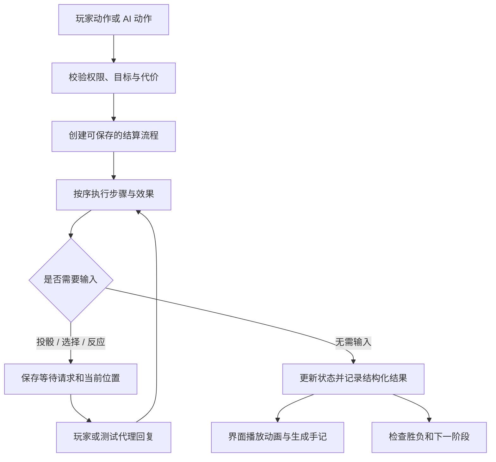

# 预兆之屋：回合与效果引擎重构方案

2026-09-16。状态：重构实施中。可序列化流程已覆盖事件检定、玩家攻击、逐个敌人的移动攻击、普通移动与入房、物品/预兆获得、作祟检定、电梯、坍塌及剧本目标检定，并已支持按值分支、循环、嵌套暂停和可恢复选择请求；声明式反应会暂停后续效果，回答后从存档中的父流程续体恢复。检定已提供 BeforeCheck / AfterRoll / AfterCheck 时机，普通移动已为 BeforeRoomEnter / AfterRoomEnter 提供可保存反应，物品与预兆获得已为 BeforeCardGain / AfterCardGain 提供可保存反应且不会重复授予卡牌；伤害分配与所有致命属性变化已为 BeforeDamage / AfterDamage / BeforeDeath / AfterDeath 提供可保存反应，并在恢复时避免重复扣除属性；尚未迁入 Workflow 的时机若请求暂停会原子回滚并报错，不再让父结算错误地继续执行。多人反应按当前座位开始的稳定顺序逐个响应，支持显式跳过；联机超时由服务端时钟验证并在轮询时执行声明的默认选择。正常试玩不再创建投骰试跑或动作捕获状态，生产路径中的 `_rollCapture` 与 `_rollReplay` 均已删除。Modifier 已接管卡牌检定、治疗、移动、精神减伤、月光力量和伤害上限；Trigger 已接管狼毒/保护时钟、月光回血、伤害、检定、卡牌获得、进入房间、死亡、人物/整轮起止、作祟开始和状态过期时机；Action 注册表已接管特殊房间、物品管理与使用、休息、封窗、治疗、攻击、狼群追猎指令和现有剧本目标，检定与交互 Workflow 由行动定义声明。物品、地图、移动、抽牌、属性和状态均可通过白名单 Effect 操作，原子效果批次在任一步失败时回滚全部修改；生产中的狼毒感染与治疗也已改走 Status Effect，治疗以原子批次同时移除感染并添加保护。房间实例与人物属性轨道按剧本、阶段、人物和来源优先级解析有效规则视图。联机已增加 commandId 去重和玩家投影；负责人物的座位才能响应选择，牌堆顺序、随机种子、敌对阵营属性/物品/状态、私密事件、日志、反馈、卡牌请求和流程内部数据均不会投影给无权客户端；结构化事件已接入探索手记，敌人移动、投骰、属性、伤害、状态和物品展示开始直接消费事件。正式 `createGame` 与联机服务现在默认使用 Workflow；确定性直算只通过显式 `createSimulationGame` 适配器供自动试玩和差分测试使用。v2/v3 存档通过显式迁移器升级至 v4，旧版待处理投骰只能回退到明确的未提交动作边界，无法安全回退则拒绝载入。回合时机的完整 Trigger 暂停续体、逐步以 Workflow 驱动自动试玩及现有内容的原子支付标注仍待完成，引擎重构尚未完成。

当前实现进度：

| 能力       | 已完成                                                                                                                                                                                                                                   | 下一步                                           |
| ---------- | ---------------------------------------------------------------------------------------------------------------------------------------------------------------------------------------------------------------------------------------- | ------------------------------------------------ |
| Workflow   | 流程定义注册表、JSON 流程帧、多次等待、按值/选择分支、循环与嵌套暂停；选择已接权威命令；所有现有交互投骰、普通移动及物品/预兆获得入口均已迁移；多人响应按座位排序并可逐个跳过；生产入口默认使用 Workflow，确定性直算由具名模拟适配器隔离 | 迁移回合时机的父流程续体                         |
| Effect     | 白名单操作、事件参数引用、执行回执、暂停续体、每批步数上限；伤害、属性、状态、移动、抽牌、物品、地图、检定骰调整/重投及反应请求；原子批次失败时完整退款；物品效果与使用次数/充能/消耗已原子提交                                          | 继续迁移新增的多步支付内容                       |
| Modifier   | sum/max/unique/replace/cap、来源追踪、卡牌和月光查询、剧本运行时修正、物品实例来源；房间与人物轨道有效规则视图                                                                                                                           | 需要改门和楼层连接时使用地图事务，不直接覆盖拓扑 |
| Trigger    | 稳定优先级、同一根动作限次；状态、月光、伤害、检定、卡牌获得、进入房间、死亡、回合、作祟和过期时机；反应窗口支持多响应者、保存恢复和服务端超时                                                                                           | 增加玩家自选同优先级触发顺序                     |
| Action     | 可用性、目标命令、文案、处理器与 Workflow 共用定义；特殊房间、物品、休息、封窗、治疗、攻击、狼群指令和剧本目标已迁移                                                                                                                     | 将剩余内容检定参数统一声明为 checkSpec           |
| 物品实例   | definitionId / instanceId、独立使用与次数状态、转移、房间放置/拾取、旧字符串存档兼容、主动注册表                                                                                                                                         | 为房间容器和死亡掉落补正式地图事务               |
| 展示与联机 | 保留 queue 与 revision；commandId 去重；按阵营与人物过滤状态、规则、事件、日志、反馈、请求和流程内部数据；服务端权威选择超时；服务端从 Action 注册表验证内容命令；移动、投骰、属性、伤害、状态和物品提示已消费结构化事件                 | 删除旧存档外的重复展示字段与重复日志拼接         |

下一实施批次按依赖顺序推进：

1. 将回合时机纳入可序列化父流程；完成后再为同优先级触发器增加显式顺序选择。
2. 逐步淘汰重复的结算日志拼接和旧展示字段；`enemyMovements` 仅保留旧存档显示回退。
3. 让自动试玩代理直接驱动 Workflow，待差分覆盖稳定后继续缩小直算适配器，并继续手机端布局。
4. 要求后续涉及多步支付的内容使用原子 Effect 批次，统一取消与退款行为。

## 1. 结论与优先级

现有实现适合验证玩法，已经有确定性随机数、状态快照、统一动作入口、待处理队列和卡牌运行时覆盖。但尚无统一的游戏效果 Hook 系统。React 的 useEffect 等 Hook 只管理界面，不承担游戏规则扩展。

建议保留 React、现有地图算法、试玩工具和联机服务边界，逐步建立“明确的回合状态机 + 可持久化结算流程 + 规则修改器 + 内容注册表”。先替换高风险的结算方式，再迁移内容，最后收薄 UI。单纯把大文件拆小、增加全局事件总线或把数值搬进 JSON，不能解决连锁效果问题。

首个交付切片中的连续检定、伤害和受伤后反应已分别通过可保存测试；后续将它们组合成一条完整内容流程。这比先迁移全部卡牌更能证明架构可用。

## 2. 当前代码的具体情况

### 必须覆盖的动态规则范围

扩展对象不局限于卡牌。地图块、人物属性轨道、物品及其各自的效果，都可能因剧本、其他卡牌、阶段或临时状态而改变。统一采用“基础定义 + 实例状态 + 有来源与期限的规则覆盖”，通过同一解析入口提供当前有效规则；禁止 UI、AI 或合法性校验绕过解析入口直接读取基础定义。

- 地图块：卡牌类型、房间触发效果、移动代价、门与楼层连接、可用行动均可覆盖。拓扑修改须通过地图事务校验并更新可达性，处理房内人物与物品；不能只改图标而保留旧的寻路结果。
- 属性轨道：轨道格值、当前位置、起始位置、上下限、是否存在该属性及固定值属性分别建模。改变轨道定义时必须声明当前位置如何映射（保留格位、按数值映射或指定位置）和是否触发死亡检查，不能默默重置人物。临时数值加成与永久格位移动分开处理。
- 物品：按实例保存持有者、使用次数与状态；剧本可增加、替换或停用其被动修正、触发效果和主动行动。失去物品、状态到期或退出适用阶段时，其贡献应准确撤销，不通过反向加减猜测恢复原值。
- 规则覆盖：记录来源实例、目标范围、条件、优先级、叠加策略、有效期与版本；发生冲突时按明确规则处理。同一有效规则视图同时供描述、属性展示、可用行动、AI 和结算使用，避免显示与实际不一致。

迁移验收需要加入组合场景：作祟开始同时替换房间效果、改变人物轨道并赋予物品新能力；移除其中一个来源只撤销它的贡献；保存恢复后结果一致。等待中的检定应保存已确定的规则版本和参数，反应窗口允许的修改通过显式步骤执行，不能因重新读取描述而偷偷改变已经支付代价的动作。

| 位置（审查时行号）                                        | 已有能力 / 问题                                                                   | 对后续内容的影响                                                      |
| --------------------------------------------------------- | --------------------------------------------------------------------------------- | --------------------------------------------------------------------- |
| lib/game-engine.mjs:42、1745                              | 种子随机数、act(state, action) 入口                                               | 可以保留确定性与单人/联机共用内核                                     |
| lib/card-rules.mjs:27、64                                 | resolveCard / updateCardRule 按阶段、剧本、人物覆盖可序列化字段                   | 能修改已有能力的参数和文案；并非注册任意效果                          |
| lib/card-rules.mjs:138 附近                               | use 只允许 movement / healPhysical / healMental，bonus 也是有限枚举               | 加“重投一颗骰子”“队友代受伤害”仍需修改引擎分支                        |
| lib/game-engine.mjs:404                                   | applyEffect 先处理属性变化，再处理伤害，直接返回                                  | 一个效果对象同时声明两项时不会顺序执行两项；缺少 Sequence 等组合能力  |
| lib/game-engine.mjs:993                                   | endRound 同时推进时间、过期状态、感染转化、回血、敌人移动攻击、生成敌人和判定失败 | 新增回合效果必须理解并改动整条流程，容易影响先后次序                  |
| lib/game-engine.mjs:541、593、700                         | 电梯、入房、作祟初始化各有具体规则分支                                            | 特殊房间、剧本持续改图不能独立作为内容包加载                          |
| lib/game-engine.mjs（旧实现）                             | 曾用 _rollCapture 全零试跑并以 _rollReplay 重跑；生产路径已删除二者               | 旧 diceRequest 仅能由迁移器回退到明确的未提交动作边界，不能重放旧结果 |
| lib/roll-outcomes.mjs:30、111 与 lib/game-engine.mjs:1394 | 特殊行动的预览和执行分别组织；治疗预览读常量，执行仍比较字面量 3                  | 改动可能只更新一处，出现“说明与实际效果不符”                          |
| lib/game-engine.mjs:383、894                              | queue 混合伤害分配、房间到达、卡牌流程、通知                                      | “规则还没完成”和“只是还没看完动画/文字”不够清晰                       |
| scripts/room-server.mjs:33                                | snapshot 已通过 projectGameForPlayer 过滤牌堆、种子、敌对阵营状态与私密请求       | 新增秘密字段时必须同步声明可见范围，不能仅靠 UI 不渲染                |
| app/page.jsx                                              | 审查时约 2145 行，游戏引擎约 1966 行                                              | 拆分有价值，但行数本身不是首要问题；规则职责与 UI 职责的边界更重要    |

这些是静态代码审查结论；并不意味着每一种潜在连锁错误都已在现有卡牌中复现。当前 196 项测试是迁移基线，不代表未来效果组合已获得覆盖。

## 3. 参考的开源实现

### boardgame.io：借鉴生命周期与动作边界

官方文档区分 phase 和 turn，支持 onBegin、onEnd、endIf，并明确这些钩子的执行顺序。适合借鉴“阶段允许哪些动作、阶段何时结束、开始/结束如何处理”的组织方式。它是通用框架，不是完整的复杂卡牌效果系统。[官方源码文档](https://github.com/boardgameio/boardgame.io/blob/main/docs/documentation/phases.md)

本项目当前探索/作祟切换可在人物行动中发生，且一整轮包含多人行动和敌人行动。应自行定义对应语义，不能直接照搬其他框架的 turn。当前建议借鉴结构，保留既有入口；没有必要为获得几个生命周期钩子同时迁移联机、存档、随机数和 UI。

### 无名杀 noname：借鉴触发技、主动技、持续修改的分离

官方仓库技能文档将 trigger/filter/cost/content、主动使用能力与 mod 规则修改分开，并提供触发角色范围、次数限制等字段。这与本作“持物品、受伤反应、同室支援、剧情新增行动”非常接近。[技能格式文档](https://github.com/libnoname/noname/blob/main/docs/lib-skill-format.md)

借鉴其“时机—条件—代价—效果”模型与 mod 分类。实际执行采用本项目可序列化步骤，不直接保存 async 函数调用栈，也不把 UI 对象传入规则模块。

### The Battle for Wesnoth：借鉴事件内容与叠加声明

EventWML 将事件名称、过滤条件、是否首次触发和事件 ID 分开，并细分回合相关时机；AbilitiesWML 则对能力影响目标和叠加行为提供声明。这适合房间、区域光环与持续状态。[EventWML](https://wiki.wesnoth.org/EventWML)、[AbilitiesWML](https://wiki.wesnoth.org/AbilitiesWML)

借鉴首次触发标记、目标过滤和叠加组的设计。这里不引入 WML/Lua 解释器，也不直接照用其具体数值合成规则；本项目需要明确自己的同类不叠加、加法、替换、上限等语义。

以上为原项目提供的机制；以下接口与目录结构均是针对本作的设计提案。

## 4. 建议的核心流程



权威入口建议为 `dispatch(state, command, principal) → { state, events, requests }`。单人由本地适配器驱动；联机由服务端驱动。UI、AI、自动测试都通过这个入口发出动作。

### 4.1 回合状态机

分别记录三个层次，避免继续扩大 phase 字段的含义：

- 章节：exploration / haunt / gameOver。
- 整轮：roundStart → heroesAct → roundEndStatuses → enemiesAct → roundEndCheck → 下一轮。
- 人物行动：turnStart → acting → turnEnd；同轮可按当前规则切换未结束人物。

第一版状态图必须以当前实际顺序为准：当前狼人感染倒计时及转化发生在敌人行动前，新转化狼人本轮不追猎；受伤分配完成后才刷新下一轮移动力。不得用重构顺便改成另一套顺序。

额外行动插入调度表；冻结、跳过行动改变调度资格。章节切换允许在一次动作流程中启动自己的子流程，处理完后根据规则恢复或终止原流程。

### 4.2 可保存的结算流程

先提供少量显式步骤：Sequence、Branch、RequestRoll、RequestChoice、DealDamage、ChangeTrait、AddStatus、RemoveStatus、MoveEntity、DrawCard。需要复杂地图操作时调用受控的 RelocateRoom 等专用步骤。

流程实例只保存 JSON：`flowId、definitionId、definitionVersion、step、locals、childFrames、waitingRequestId`。实现函数放在固定注册表中，用 ID 查找。不要把闭包、Promise、DOM 或生成器对象写进存档。

例如：敌人移动完成 → 请求本次攻防骰 → 结算伤害及死亡 → 执行触发效果 → 重新查询存活目标 → 下一个敌人。每一步都使用此时的真实状态，避免预先算完整轮敌人的所有行动。

随机数只在权威内核真正执行 RequestRoll 时消费，记录 rollId、骰面和必要加值。回放使用已记录结果；兼容旧版种子流与新机制的版本差异。查询可用动作、查看卡牌和预览不得消费随机数或修改状态。

`checkSpec` 同时给出骰子来源、加值、阈值/对抗规则和结果分支，供执行与预览共用。复杂效果的文案允许人工编写，但必须绑定同一参数；不试图从任意 JavaScript 自动推导完整自然语言。

### 4.3 三种扩展接口

| 接口                 | 职责                                          | 例子                                                 |
| -------------------- | --------------------------------------------- | ---------------------------------------------------- |
| Modifier：查询修改器 | 纯计算，返回可追踪的数值/资格变更，不改变状态 | 月光力量 +1、银色吊坠治疗 +2、改用理智攻击           |
| Trigger：时机触发器  | 在明确时机创建新步骤或反应请求                | 实际受伤后反击、人物行动开始时中毒、进入房间首次检定 |
| Action：主动能力     | 声明何时可用、合法目标、消耗与执行流程        | 花 1 移动启动电梯、封窗、使用咖啡、交付道具          |

这三种都可由卡牌、人物、状态、房间和剧本注册。UI 按能力描述渲染，不再为每张卡牌新增一套可用性判断。

### 4.4 时机契约与先后顺序

首批时机围绕已经需要的行为建立，不一次设计上百个名称：

- RoundStarting / RoundEnding、TurnStarting / TurnEnding。
- BeforeRoomEnter / AfterRoomEnter / RoomDiscovered；到达方式携带 walk、stairs、fall 等原因，避免电梯搬家被当成普通重新入房。
- BeforeCheck / AfterRoll / AfterCheck。
- BeforeDamage / AfterDamage、BeforeDeath / AfterDeath。
- BeforeCardGain / AfterCardGain、HauntStarted、StatusExpired。

“Before”接收待处理操作草案，只能返回约定的替换、取消或修正；“After”接收不可更改的已提交事实。AfterDamage 中的 actualAmount 必须是减伤、分配完成后的实际伤害，不能使用原始攻击差值。回复生命不等于取消已经发生的伤害。

同一时机先收集触发实例并固定顺序：时机层级 → priority → 稳定 sourceInstanceId → effectId。执行前再次检查目标、拥有权和次数资格。需要由玩家决定顺序时，生成显式选择请求并记录选择，而非依赖对象遍历顺序。

触发实例携带 causeId、rootActionId、sourceId。对同一因果链设重复触发规则、最大深度和步数限制；检测到循环时返回带原因链的诊断，不能直接静默跳过，亦不能留下半扣道具的状态。

### 4.5 叠加、持续时间和物品实例

- 修改器声明 stackGroup 与策略：sum / max / unique / replace / cap。先对同组去重或取最大，再按明确定义的运算阶段合并；多重 replace 必须有优先级或报冲突。
- 例如银色吊坠：查询治疗双方持有物，取 `healing.silverLocket` 组最大 +2，进入对应作祟剧本才生效。保留贡献来源，便于 UI 悬浮解释“+2 从哪里来”。
- 状态实例记录 instanceId、definitionId、source、owner、appliedAt、duration、stacks、usage。持续时间明确使用 ownerTurnEnd / roundEnd / enemyPhaseEnd / nextCheck 等时钟，并说明是否跳过施加当次时机。
- 狼毒、净血保护分别迁移原有 acquired / until 语义；“持续两轮”不使用模糊的 roundsLeft 通吃所有情况。
- 物品拆为 definitionId 与 instanceId，位置只属于一个人物、房间或容器。同类两件道具可独立消耗、转移和记录次数；实例存储增加也需要版本迁移。

## 5. 一个效果如何添加

下面是提议的数据结构示意，不是目前可执行的 API。辅助函数名必须在实现时收敛成正式契约。

```js
const thorns = {
  id: 'status.thorns',
  version: 1,
  triggers: [
    {
      when: 'AfterDamage',
      scope: 'ownerIsTarget',
      filter: { actualDamageAtLeast: 1, causeTag: 'attack' },
      limit: { per: 'rootAction', count: 1 },
      effects: [
        {
          op: 'DealDamage',
          target: '$event.source',
          amount: 1,
          damageType: 'physical',
          tags: ['reflection'],
        },
      ],
    },
  ],
};
```

执行器验证攻击者存在、仍是合法目标；反伤不带 attack 标签，且同一根动作只触发一次，避免双方反伤循环。伤害结果与触发来源自动进入手记。

首批迁移验证用例：

| 效果           | 对应扩展点                                    | 验证目的                                       |
| -------------- | --------------------------------------------- | ---------------------------------------------- |
| 银色吊坠       | Modifier + stackGroup                         | 双方持有不叠加、阶段改变即时生效               |
| 月光           | 房间环境 Modifier，另有敌人行动时回血 Trigger | 位置/封窗改变后立即重算，计算查询本身不回血    |
| 狼毒与净血保护 | Status + 指定时钟                             | 新感染本次不误扣、过期与转化先后顺序正确       |
| 神秘电梯       | 可重复 Action + RequestRoll + RelocateRoom    | 每次收费，0–3 同层留原位，4 可同层自由合法落位 |
| 坍塌房间       | 首次 RoomDiscovered/入房契约 + 多步流程       | 坠落、选择落点、伤害、到达抽卡可逐步恢复       |
| 成功后追加检定 | Branch + 两次 RequestRoll                     | 真正摆脱全零试跑与骰子需求预收集               |

## 6. UI、动画、手记与联机

规则队列只保存未完成的规则。展示事件另存为带递增序号的记录，例如 EntityMoved、DiceRolled、DamageApplied、TraitChanged、StatusAdded、FactionChanged，并记录来源与可见范围。

UI 按顺序播放“移动 → 摇骰 → 结果 → 数值变化”。动画时长属于展示设置；未完成的展示阻止本地继续操作时，由本地控制器排队，不能因为某位旁观者的动画暂停而永久阻塞权威回合。真正需要玩家做决定的反应窗口才阻塞内核。

有重掷道具时，AfterRoll 产生有资格玩家的反应请求；没有可选反应则按现有交互自动结算，不新增“确认已结算”等步骤。多人反应先定义轮询优先级、跳过和超时策略；超时必须由权威端生成并记录动作。

手记由已提交事件生成，不从弹窗内容拼接。伤害事件保存 rawAmount、preventedAmount、actualAmount、属性分配和原因链。第一阶段保留快照 + 动作/结果记录，不建设完整的事件溯源数据库。

联机继续使用现有 revision 校验，补齐统一 requestId、commandId 去重和 principal 权限。UI 的 disabled 只是反馈；服务端重新验证是否拥有角色、是否处在可响应时机、消耗是否足够、目标是否仍合法。

引入 projectForPlayer：服务端过滤隐藏敌人、他人私有卡牌、秘密效果、随机种子/牌堆顺序及未公开待处理结果，不能继续返回整份 r.game。过滤快照、日志、预览和错误信息需要使用同一可见性规则；本地单人模式仍可以保留完整状态。

## 7. 目录与迁移方式

```text
lib/engine/
  dispatch.mjs        # 权威动作入口与调度
  lifecycle.mjs       # 章节、整轮、人物行动
  workflow.mjs        # 可序列化流程及恢复
  effects.mjs         # 基础操作执行器
  modifiers.mjs       # 查询、叠加与贡献来源
  triggers.mjs        # 时机、排序、反应资格
  requests.mjs        # 玩家/AI 输入契约
  random.mjs          # 种子与骰子记录
  projection.mjs      # 面向玩家的可见状态
  migrations.mjs     # 存档/定义版本迁移
lib/content/
  cards/ rooms/ statuses/ scenarios/
app/game-controller/ # 状态订阅、命令和展示事件队列
```

现有 lib/game-engine.mjs 先作为兼容外观，继续导出 act、actions 等接口，逐项转交新模块。新契约先采用 JSDoc 类型和运行时校验，避免同一阶段同时全量切 TypeScript 与改规则；需要时再独立迁移语言。

内容定义与运行时状态分离。内置复杂效果可以注册经过测试的代码处理器，但存档只保存处理器 ID 和参数。DIY 仅允许受限条件与操作白名单，拒绝任意 eval / 动态代码导入；第一版不承诺“所有规则都能零代码配置”。

## 8. 分阶段实施与验收

| 阶段              | 工作                                                                                 | 完成标准                                                                           |
| ----------------- | ------------------------------------------------------------------------------------ | ---------------------------------------------------------------------------------- |
| 0：固化行为       | 记录当前 196 项测试基线，保存关键局面与输入记录；区分既有规则和已确认错误            | 电梯、坍塌、感染、死亡、敌人阶段、联机骰子归属都有可重复验收用例；不靠截图判定规则 |
| 1：建立可暂停流程 | 实现 flow frame、请求 ID、单一随机入口；迁移一张事件卡与一次攻防                     | 分支追加投骰正确；每个等待点 JSON 保存/恢复后结果相同；一次动作重发不重复消耗      |
| 2：统一效果接口   | 引入 Modifier/Trigger/Action、状态时钟和叠加；迁移吊坠、月光、狼毒、保护             | 加新测试反伤效果仅改内容定义和测试；引擎调度不增加该效果名称分支                   |
| 3：迁移房间与剧本 | 电梯、坍塌、狼人敌人轮、作祟、目标检定和整轮生命周期已迁移；地图变更走事务           | 同一玩法在旧、新路径最终权威状态一致；地图关系、乘员与道具位置保持合法             |
| 4：接通展示与网络 | UI 使用能力/检定模型；服务端投影与命令去重；结构化事件已接入探索手记                 | 事件驱动移动/投骰动画；无资格玩家不能响应；隐藏字段不在其网络响应中                |
| 5：淘汰兼容路径   | `_rollCapture`、`_rollReplay` 已删除；旧待处理投骰采用显式安全回退；继续清理重复预览 | 效果注册表覆盖全部现有内容；旧存档策略明确；生产入口只留一条新调度路径             |

阶段 1–3 每次只迁移一个封闭流程，默认继续使用稳定路径；测试工具可选择新路径，禁止一局同时对同一动作应用两套引擎。新增功能实验与迁移行为修正使用独立提交。

旧快照可直接映射的字段写版本化迁移器。旧版 diceRequest 的 resumeAction/resumeQueue 无法自动假定等于新步骤位置：迁移器只在存在明确的未提交动作边界时撤销旧骰值并回退，向玩家显示兼容提示后重新执行；没有安全边界的存档拒绝载入，不能静默重掷或抹掉进度。

关键新增测试：同输入/种子确定性；所有等待点恢复；叠加顺序；反应嵌套及防循环；支付代价一次且仅一次；无合法目标时取消/退款契约；死亡后取消后续不适用步骤；章节切换中断；重复/过期/他人请求；隐藏快照与事件投影；电梯乘员与房间物品位置一致性。

对旧流程使用差分测试时允许展示文案与事件结构不同，比较规范化后的权威状态；新增的连锁规则用明确的期望结果测试，不能让旧引擎充当全部规则的真理来源。

## 9. 范围建议

### 手机端是后续 UI 的必需支持平台

规则内核、内容定义和存档不得依赖屏幕尺寸、鼠标事件或面板是否展开。桌面与手机共用命令、规则查询、等待请求和事件模型，只替换展示布局；不能为手机维护第二套规则。

- 桌面悬浮面板在窄屏采用可收起栏或底部抽屉；明确面板互斥、层级和安全区，避免手记、章节、人物状态和操作按钮互相覆盖。状态摘要、当前行动与待处理请求始终可达。
- 提示同时支持鼠标悬停、键盘聚焦和触屏点按。手机不能依赖 hover、右键或只靠长按才能发现的操作；点按查看信息与执行移动/探索必须明确区分，不能为了看说明意外消耗行动。
- 地图支持触屏平移与缩放；区分拖动和点击，避免松手时误触探索。房间与人物定位、头像标识、选中轮廓沿用统一组件；交互目标建议至少 44×44 CSS 像素，细小图标可用更大的独立触控区域，但不能遮住相邻目标。
- 布局采用容器约束、网格和统一断点，不靠给每个浮窗不断追加绝对坐标补丁。文字可换行，抽屉内部滚动，兼容屏幕安全区和动态视口高度。
- 验收覆盖 360/390/430 像素宽度、横竖屏、六人同室、六人同层、长物品名称、伤害分配与连续检定，并在真实触屏浏览器验证拖动/缩放/点击；桌面缩窄窗口不能替代触屏验收。

这是后续重构及 UI 的验收要求，不表示当前版本已完成手机端适配。

近期优先完成阶段 0–2；阶段 3 后再继续大量新增特殊卡牌。地图/UI 继续使用现有成果。本方案不要求换成 Unity/Godot，也不引入通用 ECS、微服务或数据库来解决尚不存在的规模问题。

验收重构是否有效的核心问题是：新增一件“受伤后可消耗自身反击一次”的物品，是否只需新增内容与测试；它能否在反应窗口保存恢复，是否正确支付一次代价，并且动画、手记和联机都沿用现有机制。如果仍需同时修改 endRound、投骰试跑、UI 判断和服务器动作白名单，重构就没有完成目标。
